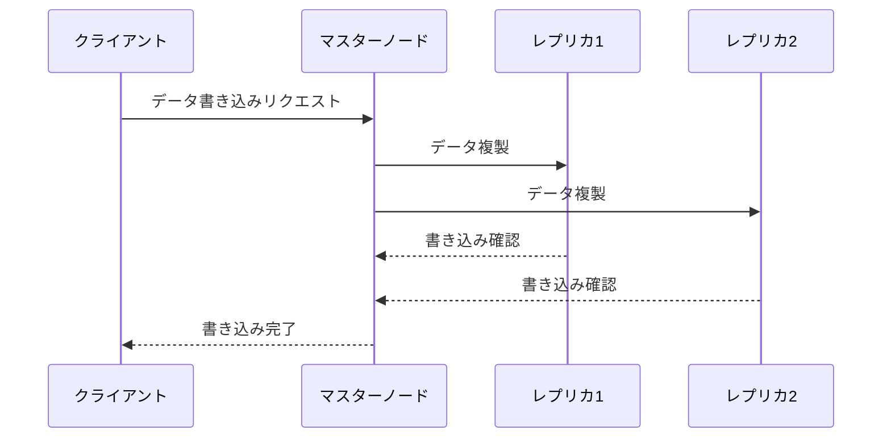
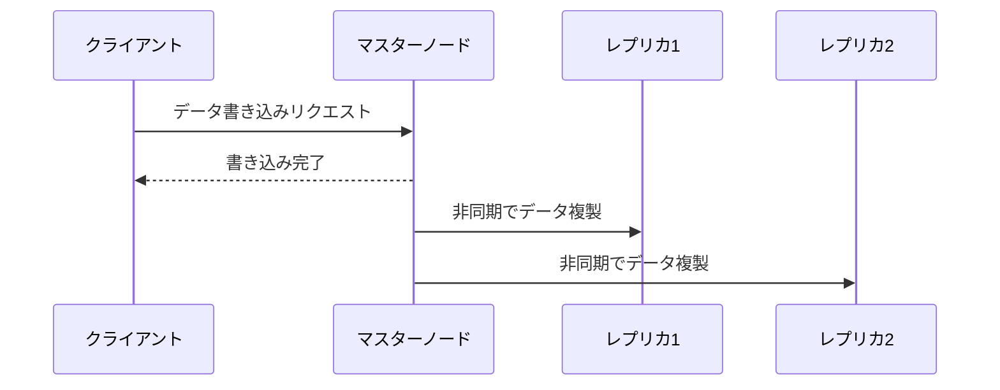

# はじめに
個人での開発や、小規模なアプリケーションでは整合性を意識して開発することは少ないかもしれませんが、複雑なシステムや大規模なアプリケーションでは整合性を意識して開発することが重要になってきます。
今回はデータベースの整合性の中でも一般的に比較される、「結果整合性」と「強い整合性」について調べたことをまとめました！
これまで整合性についてあまり意識してなかったという方の参考になれば幸いです！

## レプリケーション
整合性を理解するにあたって、レプリケーションの仕組みが重要になってきます。
レプリケーションとは、データベースが持つデータを他のサーバに複製し、データの可用性と信頼性を高める手法です。
例えば、トラフィックが多いサービスでは、データベースに負荷がかかりやすいため、レプリケーションを行うことで読み取り負荷を分散させることが重要です。
個人でDockerなどを使ってデータベースを立ち上げている場合はレプリケーションを意識することはほとんどないかもしれませんが、AWSやGCPなどのクラウドサービスを使っている場合は、内部的にレプリケーションが行われていることが多いです。

## レプリケーションの仕組みと整合性
レプリケーションを行うシステムで重要になるのが、レプリケーションが**同期的**に行われるのか、**非同期的**に行われるのかです。
### 同期レプリケーション
同期レプリケーションでは、マスターノードに書き込まれたデータが、全てのレプリカに確実に反映されたことが確認されるまでクライアントにレスポンスが返されません。これによりデータの整合性が保たれ、「**強い整合性**」が確保されます。
- メリット： データの整合性が保たれ、常に最新のデータにアクセスできる
- デメリット：全てのレプリカへの書き込み完了を待つため、書き込み処理に遅延が発生する可能性がある

### 非同期レプリケーション
非同期レプリケーションでは、マスターノードがレプリカへの書き込みを完了する前にクライアントへレスポンスを返します。これにより、高速な応答が可能になりますが、一時的にデータの不整合が発生する可能性があります。
この整合性レベルを「**結果整合性**」と呼び、最終的には全てのレプリカが最新のデータに追いつきます。
- メリット：書き込み処理が高速
- デメリット：一時的にデータの不整合が発生し、古いデータを参照する可能性がある

## 整合性のユースケース
クラウドサービスや大規模なアプリケーションでは、整合性のレベルを適切に選択することが重要になってきます。
### 強い整合性
金融取引やショッピングサイトの決済など、データの整合性が重要なシステムでは、すべてのクライアントが常に最新のデータにアクセスできる必要があります。
この場合は、強い整合性を確保するために、同期レプリケーションを採用することが一般的です。
しかし、同期レプリケーションは書き込み処理に遅延が発生するため、高速な応答が求められるシステムでは適していません。

### 結果整合性
SNSのタイムラインやニュースサイトの記事の投稿では、多少の遅延が許容されるため、結果整合性が選択肢として考えられます。
この場合は、非同期レプリケーションを採用することで、高速な応答を実現することが可能です。
特に、トラフィックが多いサービスでは、高速な応答が求められるため、結果整合性を採用することが多いです。
