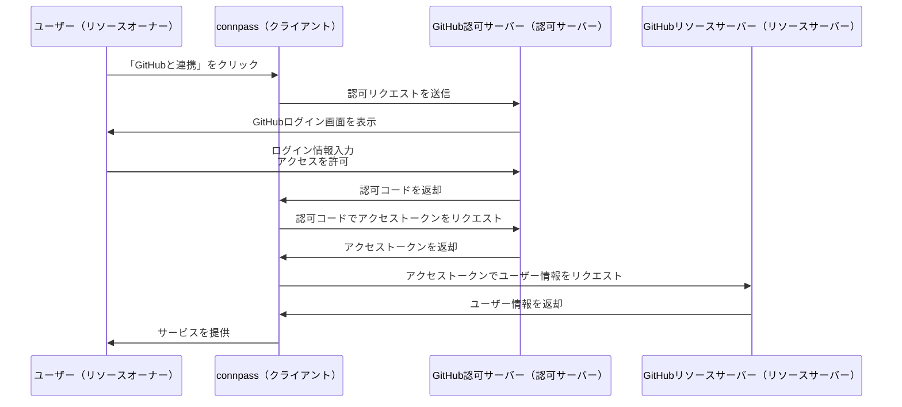

# はじめに
認可基盤の開発に関わる機会があったので、OAuth2.0の仕組みを理解するために調べたことをまとめました。
私はセキュリティについての知識がかなり浅いので、誤った情報が含まれているかもしれません。もし間違いがあれば教えていただけると幸いです！！！

# アプリ間の連携
みなさん、こんな画面見たことないですか？？

これはconnpassの画面ですが、「GitHubと連携」をクリックすると、GitHubの認証画面に飛びます。

この画像では、connpass側がGitHubのuserのメールアドレス情報をreadする権限を求めていることがわかります。
このように、アプリケーション間でユーザー情報を共有するための仕組みに使われているのが**OAuth2.0**です。

# OAuth2.0とは
OAuth2.0は、異なるアプリケーション間でユーザー情報を共有するための**認可**フレームワークです。
ユーザーが自分のパスワードなどの認証情報を第三者アプリケーションと共有することなく、自分のデータや機能へのアクセスを許可できます。

## 認証と認可
まず、**認証(Authentication)** と **認可(Authorization)** の違いを押さえておきます。

- **認証**: ユーザーが誰であるかを確認するプロセス。例として、ユーザー名とパスワードを入力してログインするなどがあります。
- **認可**: 認証されたユーザーがどのリソースや機能にアクセスできるかを決定するプロセス。

OAuth2.0は主に**認可**を扱うプロトコルであり、ユーザーの**認証**自体は他の方法で行われます。（例：OAuth2.0の拡張であるOpenID Connectでは認証も行える）
:::message
OpenID Connectの説明はここではしません。余裕があれば別途記事で書く予定です！
:::

# OAuth2.0の登場人物
connpassとGitHubの例で登場人物を4人紹介します。

1. **リソースオーナー(Resource Owner)**
   - **例**：ユーザー(あなた)
   - **役割**：リソース(例：GitHubのプロフィール情報やメールアドレス)へのアクセス権を持つ主体
2. **クライアント(Client)**
    - **例**：connpass
    - **役割**：リソースオーナーのリソースにアクセスするアプリケーション
3. **リソースサーバー(Resource Server)**
    - **例**：GitHubのAPIサーバー
    - **役割**：リソースオーナーのデータを保管し、適切な認可が与えられたクライアントにそのデータを提供するサーバー
4. **認可サーバー(Authorization Server)**
    - **例**：GitHubの認証・認可を管理するサーバー
    - **役割**：リソースオーナーを認証し、クライアントにアクセストークンを発行するサーバー

# OAuth2.0の流れ
OAuth2.0の流れはざっくり以下のようになります。

## 各ステップをざっくり説明

1. **ユーザーが「GitHubと連携」をクリック**

   - ユーザー（リソースオーナー）がconnpass（クライアント）のウェブサイトで「GitHubと連携」ボタンをクリックします。
   - この操作により、connpassはGitHubの認可サーバーへの認可リクエストを開始します。

2. **connpassがGitHubの認可サーバーにリダイレクト**

   - connpassはユーザーのブラウザをGitHubの認可エンドポイントにリダイレクトします。
   - この時、connpassが要求する権限（スコープ）やコールバックURLなどが含まれます。

3. **GitHub認可サーバーがログイン画面を表示**

   - GitHubの認可サーバーは、ユーザーにログイン画面を表示します。
   - ユーザーはGitHubの認証情報を入力してログインします。

4. **ユーザーがアクセスを許可**

   - ログイン後、GitHubはconnpassが要求した権限をユーザーに確認します。

5. **GitHubが認可コードをconnpassに返却**

    - ユーザーがアクセスを許可すると、GitHubは認可コードをconnpassに返し、ユーザーをconnpassにリダイレクトします。
    - この時に先ほどのコールバックURLを使用します。

6. **connpassがアクセストークンをリクエスト**

   - connpassは受け取った認可コードを使用して、GitHubの認可サーバーにアクセストークンをリクエストします。

7. **GitHubがアクセストークンを返却**

   - GitHubの認可サーバーはリクエストを受け取り、情報が正しければアクセストークンをconnpassに返します。
   - アクセストークンは、リソースサーバーへのアクセスに使用されます。

8. **connpassがリソースサーバーからユーザー情報を取得**

   - connpassは取得したアクセストークンを使用して、GitHubのリソースサーバーにAPIリクエストを送信します。
   - 画像の例では、GitHubのメールアドレスを取得しています。

9. **connpassがサービスを提供**

   - 取得したユーザー情報を使用して、connpassとGitHubの連携が完了し、connpassが提供するサービスをユーザーに提供します。

:::message
**補足情報**

- **コールバックURL（`redirect_uri`）について**
   - コールバックURLは事前にGitHubの開発者設定で登録されています。
   - これにより、認可コードが信頼できるクライアント（connpass）にのみ送信されることが保証されます。
   - 攻撃者が不正なコールバックURLを指定して認可コードを盗むことを防ぎます。

- **`state`パラメータの利用**
   - `state`はクライアントがランダムに生成する文字列で、セッションや一時ストレージに保存されます。
   - 認可サーバーからリダイレクトされてきた`state`と一致するか確認することで、CSRF（クロスサイトリクエストフォージェリ）攻撃を防ぎます。

- **リフレッシュトークン**
   - 必要に応じて、長期間のアクセスが必要な場合はリフレッシュトークンを使用します。

:::
# まとめ
OAuth2.0の仕組みをざっくり説明していくことで、自分の理解を深めることができました！
この記事がOAuth2.0の理解に少しでも役立てば幸いです！

# 参考記事
- https://qiita.com/TakahikoKawasaki/items/e37caf50776e00e733be
- https://zenn.dev/mryhryki/articles/2020-12-28-oauth2-flow
